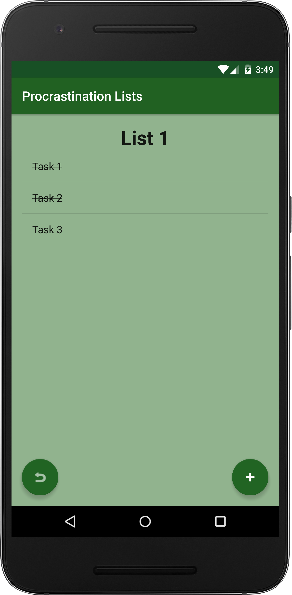

#Procrastination Lists App
###This application is meant to keep track of all the things you will not complete in the near future.
###1. The user can create multiple procrastination lists.
###2. The user can create multiple tasks in each to do list.
###3. The user can check or uncheck each task.
###4. The user can delete a task.
###5. The user can delete an entire procrastination list.

##Known Bugs
###Strike through text does not persist properly upon changing of screens

  

